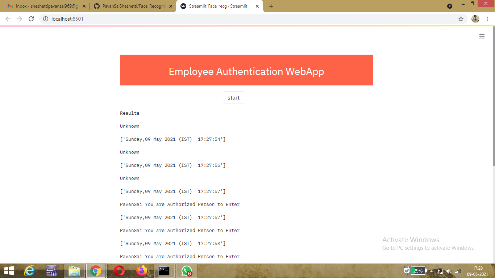
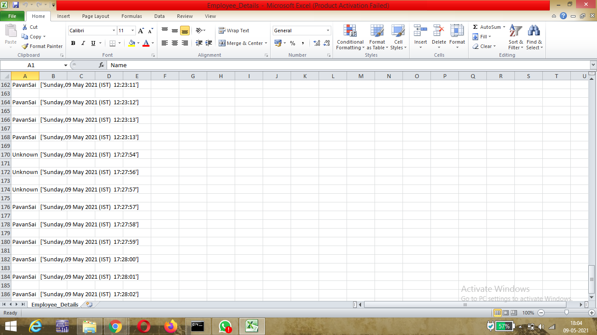

# Face_Recognition
Machine Learning Project : Employee Authentication WebApp

Demo Results:

Overview:

This is a simple Machine Learning Model. We have used CNN based dlibs art of state algorithm that built with deep learning in this project. 
This Machine learning model detect and recognizes the person in live video capturing and also upload the name of Employee and time stamp to CSV file.
This model has an accuracy of 99.38%.

Motivation:

This is Industrial project at NTPC,Ramagundam. We went there for the Internship and we found a problem there.There will be many key places in NTPC 
where unauthorized people are not allowed as it even ends their life there. So we come up with a solution to detect authorized people and allow them and selected dlibs art of state algorithm that will 
give High accuracy(99.38%).

Technical Aspect:

Magic of dlibs Face Recognition Library: 

For the dlib facial recognition network, the output feature vector is 128-d (i.e., a list of 128 real-valued numbers) that is used to quantify the face.
(128 ,measurements generated by neural net from the single picture or image). Before we can recognize faces in images and videos, we first need to 
quantify the faces in our training set. Keep in mind that we are not actually training a network here — the network has already been trained to create 
128-d embeddings on a dataset of ~3 million images.

Working Procedure of model:

=>First of all ,the model will take face encodings and name for each image(name of image) from the dataset that contains all the employee images and 
saves it into a file(save9) using pickling.

=>Then,image from the live video capture after opening the webcame will be passed to classify face() function that uses opencv. Where the face encodings of the dataset 
will be loaded from save9 file.

=>Now the Encodings of the unknown image that we passed will be determined and will be compared with the Known face encoding that are saved in 
save9 file.

=> We attempt to match each face in the input image (encoding ) to our known encodings dataset using face_recognition.compare_faces
. Internally, the compare_faces function is computing the Euclidean distance between the candidate embedding and all faces in our dataset. 

=>If the distance is below some tolerance (the smaller the tolerance, the more strict our facial recognition system will be) then we return True , 
indicating the faces match. Otherwise, if the distance is above the tolerance threshold we return False as the faces do not match.

=>The best match will ba taken and the returned name will be displayed on the screen below the region of interest of the face. If there is no match then 
Unknown will be shown on the face.  

(Names will be pushed into csv file along with the time stamp. This whole machine learning model is deployed into a website using streamlit that runs 
on local host.)

Installation:

The Code is written in Python 3.9. If you don't have Python installed you can find it [here](https://www.python.org/downloads/). If you are using a lower version of Python 
you can upgrade using the pip package, ensuring you have the latest version of pip. To install the required packages and libraries, run this command in the project directory 
after [cloning](https://github.com/PavanSaiSheshetti/Face_Recognition/) the repository:

(First [create](https://uoa-eresearch.github.io/eresearch-cookbook/recipe/2014/11/26/python-virtual-env/) an environment for your project)

pip install -r requirements.txt

(If you face any issues installing dlib,cmake and Face Recognition, [Click here](https://youtu.be/xaDJ5xnc8dc))

Run:

1.Python Train_Face_recg.py (run this command to determine the encodings and store them in save9 file.A file named 'save9' will be created in the 
same directory. Make sure you have a Dataset folder that contains the Images of Employees. Image name must be the Name of the employee,the same 
name will be displayed and pushed to csv file)

2.streamlit run Streamlit_Face_recg.py ( A link will be created and opened in the localhost with start button. On clicking the button the webcam will be 
opened and it starts recognizing the person infront of webcam.click 'p' to close the window. After closing the window names along with time stamp will be 
shown on the screen. All this data will be pushed to a csv file named 'Employee_Details'.This file will be created at the first step itself,Make sure you 
Uncomment some code that is specified in Train_Face_recg and run it )

Bug / Feature Request:

If you find a bug (the website couldn't handle the query and / or gave undesired results), kindly open an issue [here](https://github.com/PavanSaiSheshetti/Face_Recognition/issues/new) by including your search query and the expected result.

Technologies Used:

Artificial Intelligence , Machine Learning, Deep Learning,Streamlit

